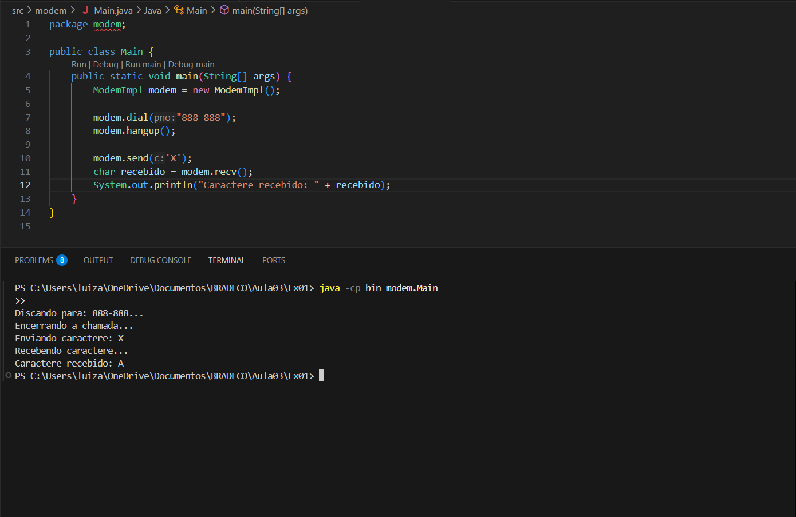

# 📌Exercício 01 - Projeto Modem 

O objetivo deste exercício foi refatorar a interface Modem para que ela siga o Princípio da Responsabilidade Única (SRP).

A interface original realizava duas tarefas diferentes:

Gerenciamento de uma conexão telefônica.

Comunicação de dados.

Para respeitar o SRP, criamos duas novas interfaces separadas, cada uma com uma única responsabilidade, com nomes claros que refletem sua função:

Connection → responsável apenas pela conexão telefônica.

DataTransmission → responsável apenas pela comunicação de dados.

## 📂 Estrutura de pastas
src/ → contém os arquivos fonte em Java.
bin/ → contém os arquivos compilados (.class).

## ✅ Vantagens
- Manutenibilidade: alterações em uma responsabilidade não afetam a outra.

- Flexibilidade: é possível implementar cada interface de formas diferentes sem impacto nas demais funcionalidades.

## 🛠️ Tecnologias usadas
Java SE 8+
Programação Orientada a Objetos
Príncipios SOLID

## ✨ Execução

